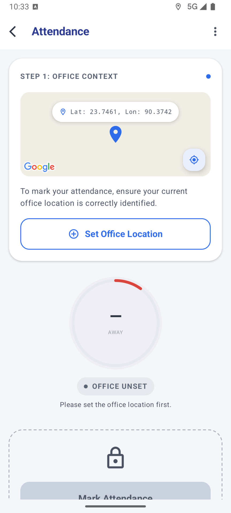
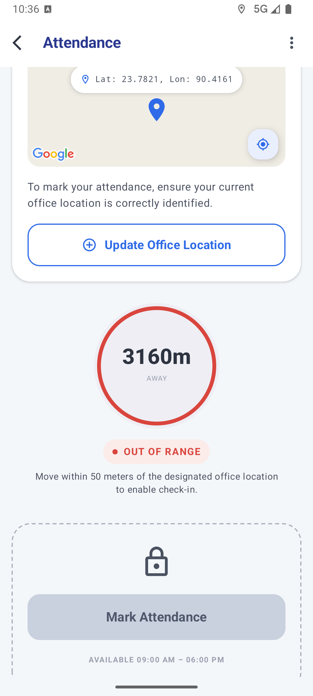
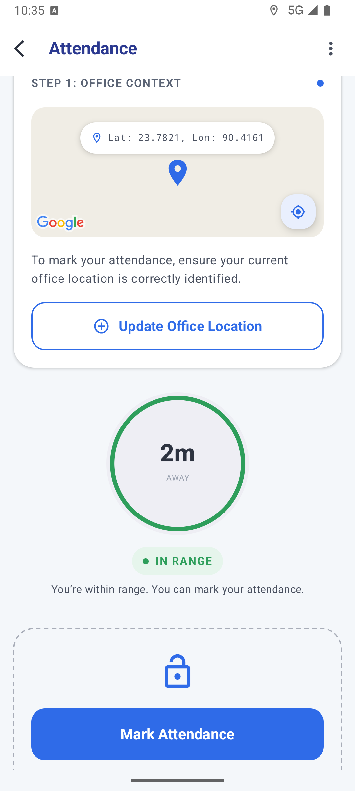
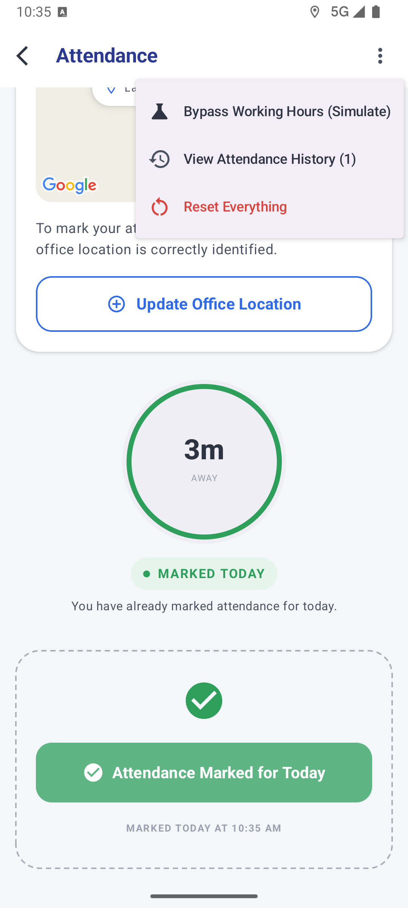
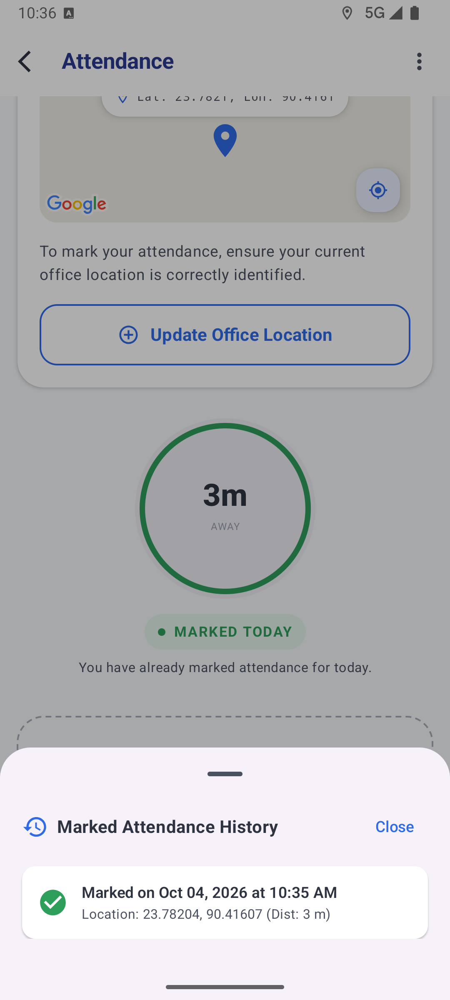
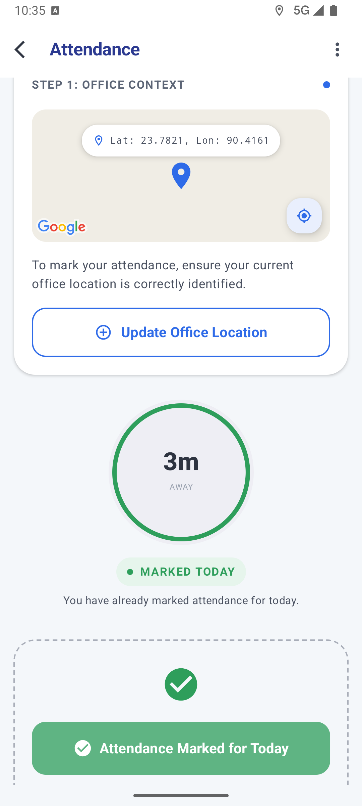

# Attendly 📍

Geo-fenced attendance marking for Android: set your office once on a live map, then check in only when you are actually there.

> ## 📲 [⬇️ Download the Signed Release APK](https://drive.google.com/file/d/16wgXV6zoZ-U7zGPGNRXKgMFHjE3rSuN-/view?usp=sharing)
>
> **Production build v1.0** — minified (R8 + resource shrinking), signed with the project keystore. Only **1.7 MB**. Open the Drive link → tap the download icon → install.

## 1. Project Title and Description

**Attendly** is a native Android app for geo-fenced attendance marking. The user defines an office location on an interactive Google Map, and attendance can be marked only when all of these hold:

1. the office location is set,
2. the user is within a **50-meter radius** of it (Haversine distance),
3. the current time is inside working hours (**09:00 AM – 06:00 PM**, both boundaries inclusive), and
4. attendance has not already been marked today.

A simulation toggle in the overflow menu bypasses the working-hours rule so the whole flow can be evaluated at any time of day.

What the app provides:

- **Office geofence setup** — drag the in-card map (or tap the my-location button) to aim the center pin at the office, then save; a 50 m circle is drawn around the saved office.
- **Live proximity feedback** — distance to the office updates with every GPS fix, shown in a progress ring with an `IN RANGE / OUT OF RANGE` chip and a one-line hint.
- **Check-in gate** — the Mark Attendance button enables only when every rule above passes; otherwise it stays locked and shows the reason.
- **Simulation mode** — overflow-menu toggle that bypasses the time rule for evaluation, badged as `SIMULATION MODE` in the top bar while active.
- **History & reset** — a bottom sheet lists all past records (time, coordinates, distance at check-in), and Reset Everything clears all stored data behind a confirmation dialog.
- **Permission & GPS handling** — in-app banners when location permission is missing (with a re-request button) or when location services are off (with a shortcut to system settings); both are re-checked every time the app resumes.
- **Lifecycle-aware tracking** — GPS updates pause while the app is backgrounded and resume on return, which keeps the app easy on the battery.

## 2. Project Structure / Approaches

The app follows a strict **Unidirectional Data Flow (UDF)** with a layered **MVI (Model-View-Intent)** architecture. The Compose UI dispatches user actions as `AttendanceIntent` to `AttendanceViewModel`, which reduces them into a single immutable `AttendanceState` exposed as a `StateFlow`, and emits one-off side effects (`AttendanceEffect`, a `SharedFlow`) for snackbars and map camera animation. The UI never mutates state directly — it renders as a pure function of `AttendanceState`:

```
User action ──AttendanceIntent──▶ AttendanceViewModel ──▶ Use Cases (domain) ──▶ Repository (data)
     ▲                                  │                                        │
     └──── AttendanceState (StateFlow) ──┘        AttendanceEffect (SharedFlow) ◀─┘
```

Because the cycle runs one way — Intent → ViewModel → State → Render — every screen state is reproducible from the state class alone, and every layer is testable in isolation. `AttendanceState` and the models it holds are annotated `@Stable`, so the Compose compiler can skip recomposition when an unchanged state is emitted.

Business rules live in framework-free use cases (`ValidateAttendanceEligibility`, `MarkAttendance`, `SaveOfficeLocation`); persistence comes from a Preferences DataStore repository, and location from a FusedLocationProviderClient tracker. Both are bound via Hilt. Core library desugaring is enabled so `java.time` works on every supported API level (down to 24).

```
app/src/main/java/com/appsbase/attendly/
├── AttendlyApplication.kt      # @HiltAndroidApp
├── MainActivity.kt             # single screen, edge-to-edge
├── core/time/                  # TimeProvider abstraction (testable clock)
├── data/
│   ├── local/                  # AttendanceDataStore (Preferences DataStore)
│   ├── location/               # DefaultLocationTracker (FusedLocationProviderClient)
│   └── repository/             # AttendanceRepositoryImpl
├── di/                         # Hilt modules (dispatchers, tracker, repository)
├── domain/
│   ├── model/                  # OfficeLocation, AttendanceRecord, SimulationConfig, …
│   ├── repository/             # AttendanceRepository interface
│   ├── usecase/                # ValidateAttendanceEligibility, MarkAttendance, SaveOfficeLocation
│   └── util/                   # GeoFenceCalculator (Haversine), TimeValidator
└── ui/
    ├── attendance/             # AttendanceScreen, AttendanceViewModel, MVI contract
    │   └── components/         # AttendanceTopBar, GuidanceBanners, OfficeContextCard,
    │                           # ProximityWidgets, MarkAttendanceSection, history sheet, dialogs
    └── theme/                  # Material 3 color schemes (light + dark)
```

Each widget takes narrow parameters (booleans, counts, the data it renders) instead of the whole `AttendanceState`, so a GPS tick does not recompose widgets whose inputs did not change.

Eligibility is decided with a fixed precedence: `OFFICE_NOT_SET → ALREADY_MARKED → OUTSIDE_GEOFENCE → OUTSIDE_TIME_WINDOW → ELIGIBLE`. The step-by-step build plan behind this structure, including everything that changed after the plan was locked, is in [docs/PLAN.md](docs/PLAN.md).

## 3. Generative AI Usage

This project was built with an AI-agent workflow (Google Antigravity & Gemini) — not one-shot generation, but a **draft → refine plan → generate → review → iterate** loop. The actual sequence, with the real artifacts:

**Step 1 — Draft requirement.** Started from the raw task brief containing the objective, general requirements, and the functional prompt for the geo-fenced attendance screen — kept verbatim here: [docs/draft_plan.md](docs/draft_plan.md).

**Step 2 — Refine and lock the plan.** The draft was fed to the AI to refine into an executable plan. Ambiguities were resolved up front (simulation separated from production code, eligibility precedence, once-per-day check-in, Maps key via `local.properties` → manifest placeholder), the stack and layer rules were fixed, and each of the five build steps got file lists and acceptance checks. The locked plan: [docs/PLAN.md](docs/PLAN.md).

**Step 3 — Agent generates code from the plan.** The agent implemented the plan step by step — skeleton & DI → domain → data → MVI/UI → tests & docs — running each step's acceptance check before advancing. The feature commits in the git history (`feat(setup)`, `feat(data-domain)`, `feat(ui)`, `feat(test-docs)`) map to these steps.

**Step 4 — Review and iterate with practical prompts.** After each build, the project was reviewed and adjusted with short, concrete change prompts; every change was recompiled, re-tested, and verified on an emulator before being kept. The real iterative prompts:

- *"Remove the undo today option from the context menu, keeping reset everything, and update docs and tests."* — menu simplification after reviewing the simulation options.
- *"Read the whole codebase. Based on the attached Compose design mock, restyle the attendance screen; keep things simple, readable, and production-ready; remove unnecessary code, comments, and files; make the documentation concise and well structured. Do not auto-commit."* — full UI redesign to the card/ring layout plus a dead-code cleanup pass (unused state, intents, template files, and stale docs all deleted).
- *"On the top bar keep the title on the left side, and add a back button icon with arrow."* — small UI adjustment, confirmed on the emulator by tapping the back arrow.

Later passes continued the same loop: the screen was split into per-widget component files with previews for every state case, GPS collection was made lifecycle-aware (pause on background, resume on return), core library desugaring was enabled for `java.time` on older API levels, and the UI models were annotated `@Stable` for Compose. Anything that did not survive review was deleted rather than patched around — the plan and this README were themselves rewritten twice from review feedback.

## 4. How to Run

**Prerequisites:** Android Studio, JDK 17, Android SDK 36, a Google Maps API key, and a device or emulator with Google Play services (Android 7.0 / API 24 or newer).

1. **Clone the repository:**
   ```bash
   git clone <REPO_URL>
   cd attendly
   ```
2. **Configure the Maps key** — copy [`local.properties.example`](local.properties.example) to `local.properties` (git-ignored) and fill in your key. It is injected into the manifest at build time and never committed to version control:
   ```bash
   cp local.properties.example local.properties
   ```
   ```properties
   MAPS_API_KEY=YOUR_ACTUAL_GOOGLE_MAPS_API_KEY
   ```
3. **Run the app:**
   ```bash
   ./gradlew installDebug        # build & install on a connected device/emulator
   ```
4. **Run the unit tests** (25 tests across four suites):
   ```bash
   ./gradlew test
   ```

   | Suite | Tests | Covers |
   | :--- | :--- | :--- |
   | `GeoFenceCalculatorTest` | 5 | Haversine distance; inside / exact 50 m boundary / outside; custom radius |
   | `TimeValidatorTest` | 5 | Shift boundaries (08:59, 09:00, 18:00, 18:01) and simulation bypass |
   | `ValidateAttendanceEligibilityUseCaseTest` | 7 | Full eligibility matrix (unset office, already marked, out of range, out of hours, bypass, eligible) |
   | `AttendanceViewModelTest` | 8 | MVI intent→state transitions: permissions, GPS disabled/re-enabled refresh, pause/resume tracking, map targeting, save office, mark attendance, simulation toggle, reset |

5. **Build a release APK** (minified, resource-shrunk, and signed when the key is present — output: `app/build/outputs/apk/release/`):
   ```bash
   ./gradlew assembleRelease
   ```

   **Release signing.** The signing key lives in the git-ignored `key/` folder: `apps_base_key.jks` (the keystore) and `key_properties.txt` (credentials, one per line, in the `key_store_password:` / `key_alias:` / `key_password:` format). The build script finds the folder and signs the APK automatically. On a machine without it — say, a fresh clone or CI — the release build still succeeds, it just produces an unsigned APK. To confirm an APK carries the project signature:

   ```bash
   apksigner verify --print-certs app/build/outputs/apk/release/app-release.apk
   ```

   The printed certificate should match the one `keytool -list -keystore key/apps_base_key.jks` reports. Keep the `key/` folder backed up somewhere safe; it is deliberately never committed to the repository.

**Troubleshooting.** A blank or beige map usually means the Maps key is missing from `local.properties` or the device has no network. An amber *GPS is Disabled* banner means device location services are off — tap **Enable GPS** or enable location in quick settings. The distance stays `—` until the first GPS fix arrives, so grant location permission when prompted.

## 5. Screenshots & Demo

### Interactive Demo Walkthrough

<p align="center">
  
</p>

### Step-by-Step State Flow

Captured on an emulator (1080 × 2400), following the complete user journey from first launch to a marked day:

| 1. Office unset (first launch) | 2. Out of range (3,160 m) | 3. In range (eligible) |
| :---: | :---: | :---: |
|  |  |  |
| Aim map at office; check-in locked until saved. | Ring and chip turn red; button explains requirement. | Within 50 m; Mark Attendance button unlocks. |

| 4. Simulation mode & menu | 5. History bottom sheet | 6. Marked today |
| :---: | :---: | :---: |
|  |  |  |
| Bypass hours toggle, record count, and reset. | Every record with timestamp, coordinates, and distance. | Verified check-in status for the calendar day. |
